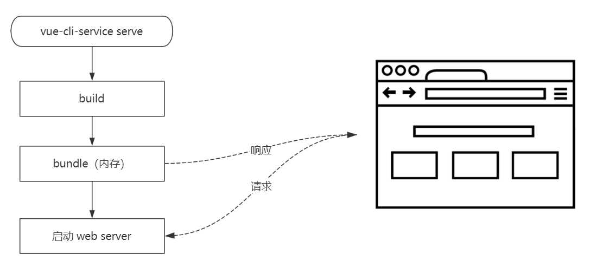
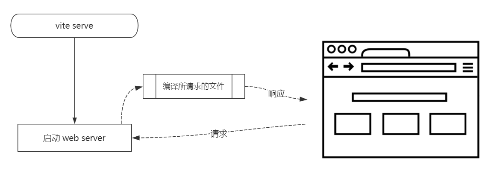
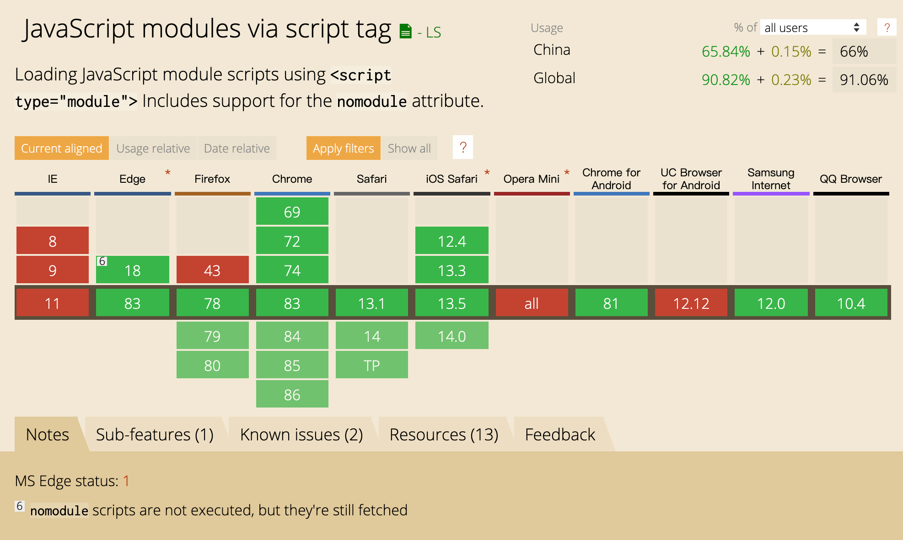
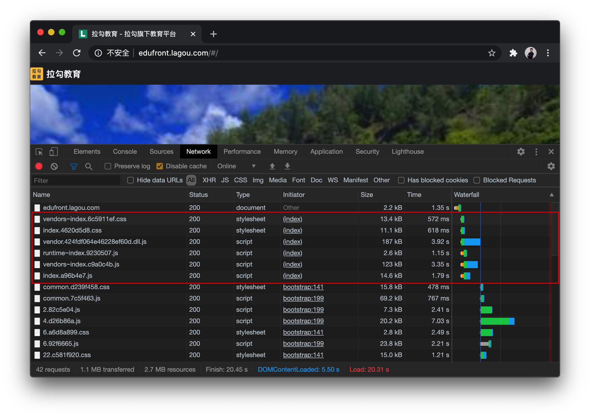

# 前端新玩具：Vite

## 知识储备

- 掌握 ES Modules 特性
- 了解 HTTP 2 标准

## 相关介绍

### Vite 的定义

面向现代浏览器的一个更轻、更快的 Web 应用开发工具，

基于 ECMAScript 标准原生模块系统（ES Modules）实现。

### Vite 的由来

如果应用比较复杂，使用 Webpack 的开发过程相对没有那么丝滑。

- Webpack Dev Server 冷启动时间会比较长
- Webpack HMR 热更新的反应速度比较慢

## 快速上手

Vite 官方目前提供了一个比较简单的脚手架：create-vite-app，可以使用这个脚手架快速创建一个使用 Vite 构建的 Vue.js 应用

```shell
$ npm init vite-app <project-name>
$ cd <project-name>
$ npm install
$ npm run dev
```

如果使用 yarn：

```shell
$ yarn create vite-app <project-name>
$ cd <project-name>
$ yarn
$ yarn dev
```

> P.S.
> `npm init` 或者 `yarn create` 是这两个包管理工具提供的新功能，
> 其内部就是自动去安装一个 `create-<xxx>` 的模块（临时），然后自动执行这个模块中的 bin。
> 例如:
> `yarn create react-app my-react-app` 就相当于先 `yarn global add create-react-app`，然后自动执行 `create-react-app my-react-app`

### 对比差异点

打开生成的项目过后，你会发现就是一个很普通的 Vue.js 应用，没有太多特殊的地方。

不过相比于之前 vue-cli 创建的项目或者是基于 Webpack 搭建的 Vue.js 项目，这里的开发依赖非常简单，只有 vite 和 @vue/compiler-sfc。

vite 就是我们今天要介绍的主角，而 @vue/compiler-sfc 就是用来编译我们项目中 .vue 结尾的单文件组件（SFC），它取代的就是 Vue.js 2.x 时使用的 vue-template-compiler。

再者就是 Vue.js 的版本是 3.0。这里尤其需要注意：**Vite 目前只支持 Vue.js 3.0 版本。**

> 如果你想，在后面介绍完实现原理过后，你也可以改造 Vite 让它支持 Vue.js 2.0。

### 基础体验

这里我们所安装的 vite 模块提供了两个子命令：

- serve：启动一个用于开发的服务器
- build：构建整个项目（上线）

当我们执行 `vite serve` 的时候，你会发现响应速度非常快，几乎就是秒开。

可能单独体验你不会有太明显的感觉，你可以对比使用 `vue-cli-service`（内部还是 Webpack）启动开发服务器，

当我们对比使用 `vue-cli-service serve` 的时候，你会有更明显的感觉。

因为 Webpack Dev Server 在启动时，需要先 build 一遍，而 build 的过程是需要耗费很多时间的。



而 Vite 则完全不同，当我们执行 `vite serve` 时，内部直接启动了 Web Server，并不会先编译所有的代码文件。

那仅仅是启动 Web Server，速度上自然就快了很多。



但是像 Webpack 这类工具的做法是将所有模块提前编译、打包进 bundle 里，换句话说，不管模块是否会被执行，都要被编译和打包到 bundle 里。随着项目越来越大打包后的 bundle 也越来越大，打包的速度自然也就越来越慢。

Vite 利用现代浏览器原生支持 ESM 特性，省略了对模块的打包。

对于需要编译的文件，Vite 采用的是另外一种模式：即时编译。

也就是说，只有具体去请求某个文件时才会编译这个文件。

所以，这种「即时编译」的好处主要体现在：按需编译。

### Optimize

Vite 还提供了一个目前在帮助列表中并没有呈现的一个子命令：optimize。

这个命令的作用就是单独的去「优化依赖」。

所谓的「优化依赖」，指的就是自动去把代码中依赖的第三方模块提前编译出来。

例如，我们在代码中通过 `import` 载入了 vue 这个模块，那通过这个命令就会自动将这个模块打包成一个单独的 ESM bundle, 放到 `node_modules/.vite_opt_cache` 目录中。

这样后续请求这个文件时就不需要再即时去加载了。

### HMR

同样也是模式的问题，热更新的时候，Vite 只需要立即编译当前所修改的文件即可，所以响应速度非常快。

而 Webpack 修改某个文件过后，会自动以这个文件为入口重写 build 一次，所有的涉及到的依赖也都会被加载一遍，所以反应速度会慢很多。

### Build

Vite 在生产模式下打包，需要使用 `vite build` 命令。

这个命令内部采用的是 Rollup 完成的应用打包，最终还是会把文件都提前编译并打包到一起。

对于 Code Splitting 需求，Vite 内部采用的就是原生 Dynamic imports 特性实现的，所以打包结果还是只能够支持现代浏览器。

不过好在 Dynamic imports 特性是可以有 Polyfill 的：https://github.com/GoogleChromeLabs/dynamic-import-polyfill，也就是说，只要你想，它也可以运行在相对低版本的浏览器中。

### 打包 or 不打包

Vite 的出现，引发了另外一个值得我们思考的问题：究竟还有没有必要打包应用？

之前我们使用 Webpack 打包应用代码，使之成为一个 bundle.js，主要有两个原因：

1. 浏览器环境并不支持模块化
2. 零散的模块文件会产生大量的 HTTP 请求

随着浏览器的对 ES 标准支持的逐渐完善，第一个问题已经慢慢不存在了。现阶段绝大多数浏览器都是支持 ES Modules 的。



零散模块文件确实会产生大量的 HTTP 请求，而大量的 HTTP 请求在浏览器端就会并发请求资源的问题；



_如上图所示，红色圈出来的请求就是并行请求，但是后面的请求就因为域名链接数已超过限制，而被挂起等待了一段时间。_

在 HTTP 1.1 的标准下，每次请求都需要单独建立 TCP 链接，经过完整的通讯过程，非常耗时；


而且每次请求除了请求体中的内容，请求头中也会包含很多数据，大量请求的情况下也会浪费很多资源。

但是这些问题随着 HTTP 2 的出现，也就不复存在了。


关于 HTTP 1.1 与 HTTP 2 之间的差异，可以通过这个链接体验：https://http2.akamai.com/demo，直观感受下 HTTP/2 比 HTTP/1 到底快了多少。

而且不打包也有一个好处，就是可以把按需加载实现到极致。

> 关于 HTTP 2 的详细介绍，可以参考：
>
> - https://blog.fundebug.com/2019/03/07/understand-http2-and-http3/
> - https://www.digitalocean.com/community/tutorials/http-1-1-vs-http-2-what-s-the-difference

### 开箱即用

- TypeScript - 内置支持
- less/sass/stylus/postcss - 内置支持（需要单独安装所对应的编译器）

### 特性小结

Vite 带来的优势主要体现在提升开发者在开发过程中的体验。

- Dev Server 无需等待，即时启动；
- 几乎实时的模块热更新；
- 所需文件按需编译，避免编译用不到的文件；
- 开箱即用，避免各种 Loader 和 Plugin 的配置；

## 实现原理

Vite 的核心功能：Static Server + Compile + HMR

核心思路：

1. 将当前项目目录作为静态文件服务器的根目录
2. 拦截部分文件请求
   1. 处理代码中 import node_modules 中的模块
   2. 处理 vue 单文件组件（SFC）的编译
3. 通过 WebSocket 实现 HMR

### 手写实现

详细参考 [my-vite](my-vite)

```javascript
#!/usr/bin/env node

const path = require('path')
const { Readable } = require('stream')
const Koa = require('koa')
const send = require('koa-send')
const compilerSfc = require('@vue/compiler-sfc')

const cwd = process.cwd()

const streamToString = stream => new Promise((resolve, reject) => {
  const chunks = []
  stream.on('data', chunk => chunks.push(chunk))
  stream.on('end', () => resolve(Buffer.concat(chunks).toString('utf8')))
  stream.on('error', reject)
})

const app = new Koa()

// 重写请求路径，/@modules/xxx => /node_modules/
app.use(async (ctx, next) => {
  if (ctx.path.startsWith('/@modules/')) {
    const moduleName = ctx.path.substr(10) // => vue
    const modulePkg = require(path.join(cwd, 'node_modules', moduleName, 'package.json'))
    ctx.path = path.join('/node_modules', moduleName, modulePkg.module)
  }
  await next()
})

// 根据请求路径得到相应文件 /index.html
app.use(async (ctx, next) => {
  // ctx.path // http://localhost:3080/
  // ctx.body = 'my-vite'
  await send(ctx, ctx.path, { root: cwd, index: 'index.html' }) // 有可能还需要额外处理相应结果
  await next()
})

// .vue 文件请求的处理，即时编译
app.use(async (ctx, next) => {
  if (ctx.path.endsWith('.vue')) {
    const contents = await streamToString(ctx.body)
    const { descriptor } = compilerSfc.parse(contents)
    let code

    if (ctx.query.type === undefined) {
      code = descriptor.script.content
      code = code.replace(/export\s+default\s+/, 'const __script = ')
      code += `
  import { render as __render } from "${ctx.path}?type=template"
  __script.render = __render
  export default __script`
      // console.log(code)
      ctx.type = 'application/javascript'
      ctx.body = Readable.from(Buffer.from(code))
    } else if (ctx.query.type === 'template') {
      const templateRender = compilerSfc.compileTemplate({ source: descriptor.template.content })
      code = templateRender.code
    }

    ctx.type = 'application/javascript'
    ctx.body = Readable.from(Buffer.from(code))
  }
  await next()
})

// 替换代码中特殊位置
app.use(async (ctx, next) => {
  if (ctx.type === 'application/javascript') {
    const contents = await streamToString(ctx.body)
    ctx.body = contents
      .replace(/(from\s+['"])(?![\.\/])/g, '$1/@modules/')
      .replace(/process\.env\.NODE_ENV/g, '"production"')
  }
})

app.listen(3080)

console.log('Server running @ http://localhost:3080')
```

